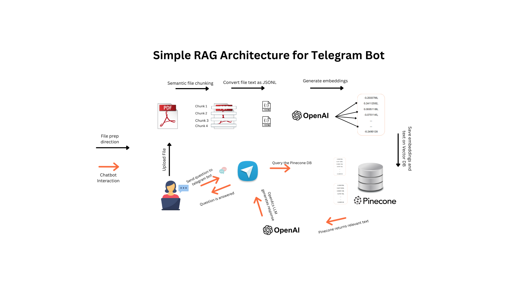

# Telegram Chatbot

**Architecture Diagram**


You can also view the diagram [here](https://www.canva.com/design/DAGTNSKnpz4/VcjDVCPbUEzs1b1v5hqxhQ/view?utm_content=DAGTNSKnpz4&utm_campaign=designshare&utm_medium=link&utm_source=editor).

This project is an interactive chatbot designed to assist users in retrieving information from study materials and generating responses using OpenAI's API and Pinecone's vector database. The chatbot is accessible via a Telegram bot interface, providing a user-friendly experience for study assistance.

## Main Packages
1. Text_Parsing
2. Embedding_Retrieval_from_OpenAI
3. Embedding_Upload_to_Pinecone
4. Chatbot_Module

## 1. Text_Parsing
### Features
The Text_Parsing package provides a suite of tools designed to parse, transform, and manage text data from PDF files. It is used for extracting relevant information for further processing. The result of the extracted text is stored in the `book_in_json_step_1` folder as JSON files.
The **orchestrating module**: 
`process_pdf.py` : This module orchestrates the extraction, chunking, and storage of text from PDF documents.


## 2. Embedding_Retrieval_from_OpenAI
### Features
The Embedding_Retrieval_from_OpenAI package provides functionality for retrieving embeddings from OpenAI's API. It allows users to convert text into embeddings and leverage these embeddings for various applications, including natural language processing tasks and information retrieval.
It makes use of the JSON files created in the **Text_Parsing** package. These files contain the PDF Texts and are initially converted to JSONL files stored in the `input_batch_step_2` folder before being sent to OpenAI for embeddings. The results are written to the  `output_embeddings_step_3` folder.
The **orchestrating module**: 
`get_embedding.py`: This module orchestrates the process of retrieving embeddings from OpenAI's API. It reads input JSON files, prepares requests, sends them to OpenAI, and retrieves the output embeddings. It utilizes the `PrepareInputJsonl` and `MonitorAndRetrieveEmbeddings` classes to handle the various steps of this workflow.


## 3. Embedding_Upload_to_Pinecone
### Features
The Embedding_Upload_to_Pinecone package facilitates uploading the embeddings to Pinecone, a vector database. Embeddings found in the `output_embeddings_step_3` folder are uploaded in batches (< 4MB) into Pinecone.
The **orchestrating module**:
`upload_to_pinecone.py`: Main script to convert chapter embeddings from JSONL files to a Pinecone index.

## 4. Chatbot_Module
### Features
This package is helps interact with the telegram chatbot designed to assist users in retrieving information from study materials and generating responses using OpenAI's API and Pinecone's vector database. The chatbot is accessible via a Telegram bot interface, providing a user-friendly experience for study assistance.
The **orchestrating module**:
`activate_telegram_bot`: This module sets up a Telegram bot that interacts with users by responding to their messages. It integrates with a chatbot API to provide informative responses based on user queries. The bot listens for messages and commands, facilitating a conversational experience.
The module uses Telegram Webhhook for messaging


## Usage
1. Clone the repository:
   ```bash
   git clone https://github.com/Olujare-Dada/Telegram_Chatbot.git
   ```
   
2. Install the required packages:
   ```bash
   pip install -r requirements.txt
   ```
3. Set up environment variables:
   - Create a `.env` file in the root directory of the project.
   - Add your OpenAI API key, Pinecone API key, and Telegram bot token to the `.env` file:
   - ```bash
     OPENAI_API_KEY=your_openai_api_key
      PINECONE_KEY=your_pinecone_api_key
      TELEGRAM_TOKEN=your_telegram_bot_token
      INDEX_NAME=your_index_name
     ```

5. Start the Telegram Bot: Run the bot using the following command:
   ```bash
   python activate_telegram_bot.py
   ```
